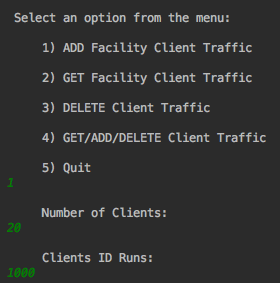
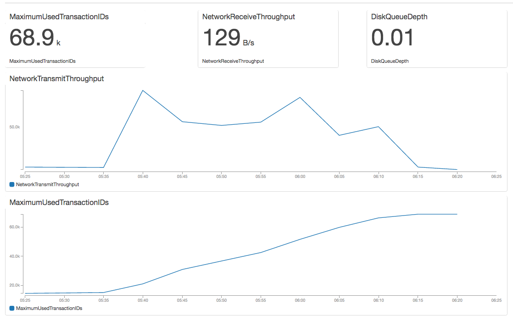
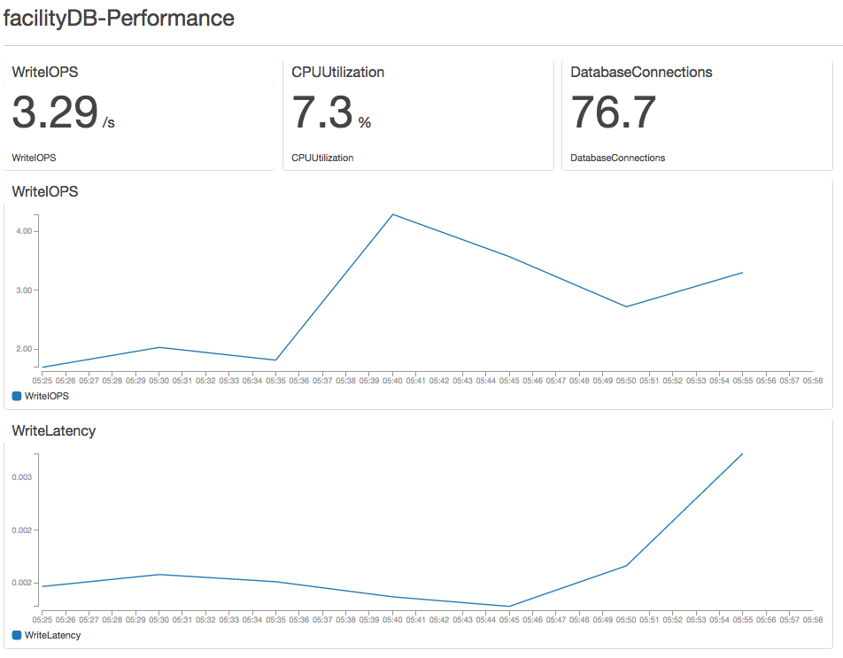

# Distributed Systems
### Spring Framework Web Application

The Spring Framework is an application framework and inversion of control container for the Java platform. The framework's core features can be used by any Java application, but there are extensions for building web applications on top of the Java EE platform.
More information here: []
## Running the JAR application 

**System requirements**
* Java 8 SDK or later

From the source directory go to the location of the application target folder:
Then run the application with the java compiler:

`java -jar  target/facility.jar`

```sh
  .   ____          _            __ _ _
 /\\ / ___'_ __ _ _(_)_ __  __ _ \ \ \ \
( ( )\___ | '_ | '_| | '_ \/ _` | \ \ \ \
 \\/  ___)| |_)| | | | | || (_| |  ) ) ) )
  '  |____| .__|_| |_|_| |_\__, | / / / /
 =========|_|==============|___/=/_/_/_/
 :: Spring Boot ::        (v1.5.2.RELEASE)
 
```

The applicaition can be access locally at:

`http://localhost:8080/facility/`

Application routes:


```sh

/chaos/rate/{rate}                 ,produces=[application/json] ChaosController.setRate()
/facility/delete                   ,produces=[application/json] FacilityController.cleanDB()
/facility/{id}                     ,produces=[application/json] FacilityController.getFacility()
/facility/add                      ,produces=[application/json] FacilityController.addFacility()
/facility/all                      ,produces=[application/json] FacilityController.getALL()
/facility/delete/{id}              ,produces=[application/json] FacilityController.deleteByID()
/facility/maintenance/{id}         ,produces=[application/json] MaintenanceController.getFacility(int)
/facility/maintenance/add          ,produces=[application/json] MaintenanceController.addMaintenance()
/facility/maintenance/all          ,produces=[application/json] MaintenanceController.getALL()
/facility/maintenance/delete/{id}  ,produces=[application/json] MaintenanceController.deleteByID()
/facility/use/{id}]                ,produces=[application/json] UseController.getMaintenance()
/facility/use/add]                 ,produces=[application/json] UseController.addFacilityUse()
/facility/use/all]                 ,produces=[application/json] UseController.getALL()
/facility/use/delete/{id}]         ,produces=[application/json] UseController.deleteByID()

```

To increase traffic to the system run the Facility client jar:
 
```sh
java -jar  target/client.jar

 Select an option from the menu:

 	 1) ADD Facility Client Traffic

 	 2) GET Facility Client Traffic

 	 3) DELETE Client Traffic

 	 4) GET/ADD/DELETE Client Traffic

 	 5) Quit
```

## Testing the spring framework context

### Facility Client


### FacilityDB Traffic Use Client


### Spring Maintenance Client


# Project Diagrams

### Composite Structure


### DB Table Structure
```sh
psql (9.6.2, server 9.6.1)
facilitydb=> \d
                     List of relations
 Schema |             Name              |   Type   | Owner
--------+-------------------------------+----------+--------
 public | facility                      | table    | devops
 public | facility_details              | table    | devops
 public | facility_facility_id_seq      | sequence | devops
 public | facility_use                  | table    | devops
 public | facility_use_order_number_seq | sequence | devops
 public | inspection                    | table    | devops
 public | maintenance                   | table    | devops
(7 rows)

facilitydb=> \d facility

            Table "facility"
    Column     |  Type   | Modifiers
---------------+---------+-----------
 facility_id   | integer | not null
 facility_name | text    |
 room_number   | integer |
 media         | boolean |
 max_capacity  | integer |
Indexes:
    "facility_pkey" PRIMARY KEY, btree (facility_id)
Referenced by:
    TABLE "facility_details"
    TABLE "facility_use"
    TABLE "inspection"
    TABLE "maintenance"

facilitydb=> \d facility_details

        Table "facility_details"
     Column      |  Type   | Modifiers
-----------------+---------+-----------
 facility_id     | integer | not null
 phone_number    | text    |
 department      | text    |
 occupied        | boolean |
 inspection_date | date    |
Foreign-key constraints:
    "facility_details_facility_id_fkey"

facilitydb=> \d facility_use

           Table "facility_use"
      Column       |  Type   |      Modifiers
-------------------+---------+-------------------
 order_number      | integer | not null 
 facility_id       | integer | not null
 customer_id       | integer | not null
 reservation_start | date    |
 reservation_end   | date    |
 inspection_date   | date    |
Foreign-key constraints:
    "facility_use_facility_id_fkey"


facilitydb=> \d inspection

            Table "inspection"
      Column       |  Type   | Modifiers
-------------------+---------+-----------
 facility_id       | integer | not null
 inspection_code   | text    |
 inspection_date   | date    |
 passed_inspection | boolean |
 description       | text    |
Foreign-key constraints:
    "inspection_facility_id_fkey"

facilitydb=> \d maintenance

            Table "maintenance"
       Column       |  Type   | Modifiers
--------------------+---------+-----------
 facility_id        | integer | not null
 start_work         | date    |
 end_work           | date    |
 facility_downtime  | numeric |
 maintenance_cost   | integer |
 maintenance_log    | text    |
 maintenance_status | text    |
Foreign-key constraints:
    "maintenance_facility_id_fkey"

```
